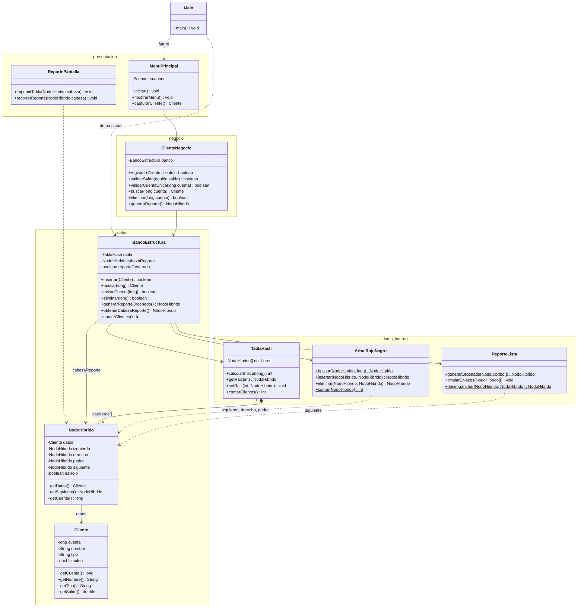
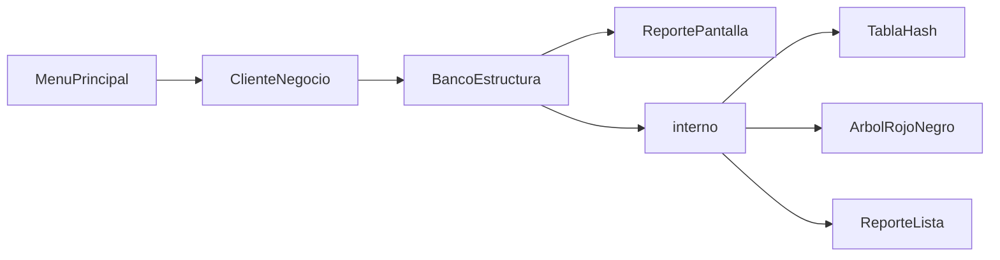

# Diagrama de clases — Sistema bancario híbrido

Vista del equipo según `Plan_Proyecto.pdf`. Lo implementado hoy está en `src/datos/`; el resto son capas que integrarán Fernando, Leandro y Luna.

- **API pública (Kevin):** `src/datos/` — `Cliente`, `NodoHibrido`, `BancoEstructura`
- **Interno:** `src/datos/interno/` — `TablaHash`, `ArbolRojoNegro`, `ReporteLista`
- **Simulador animado:** [`simulador/`](simulador/)



## Estructura de carpetas

```
src/datos/
├── Cliente.java           ← API publica (entidad)
├── NodoHibrido.java       ← API publica (nodo hibrido)
├── BancoEstructura.java   ← API publica (fachada)
└── interno/
    ├── TablaHash.java     ← arreglo hash
    ├── ArbolRojoNegro.java← balanceo por balde
    └── ReporteLista.java  ← inorden + MergeSort
```

## Leyenda

| Simbolo | Significado |
|---------|-------------|
| Canal arbol RBT | `izquierdo`, `derecho`, `padre`, `esRojo` — solo `ArbolRojoNegro` |
| Canal reporte | `siguiente` — solo `ReporteLista` |
| `casilleros[]` | Arreglo estatico; indice = `cuenta % tamano` |

## Flujo entre capas


